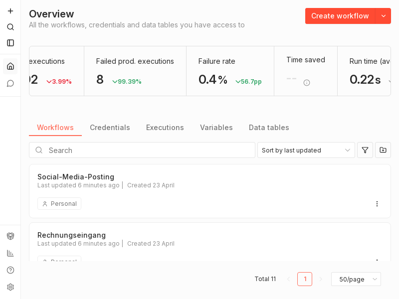
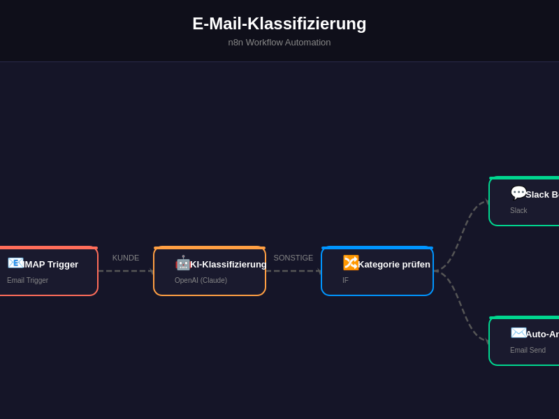
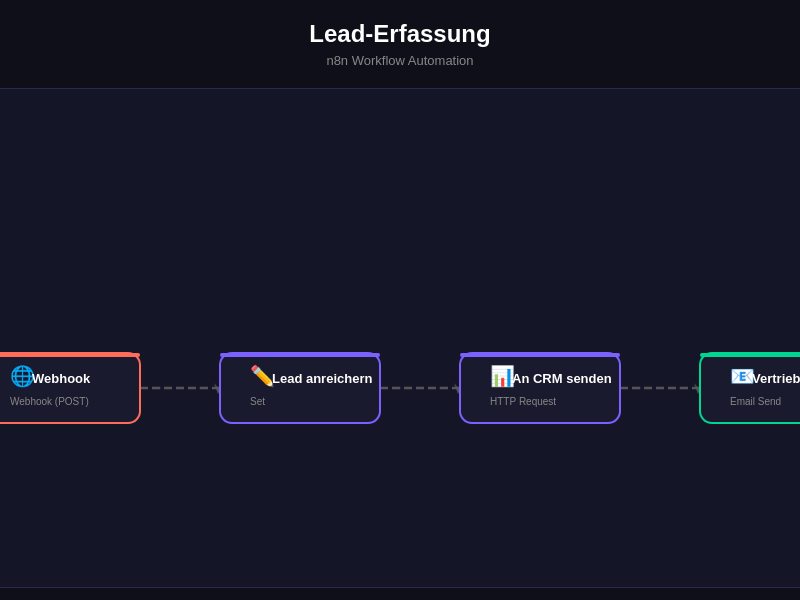
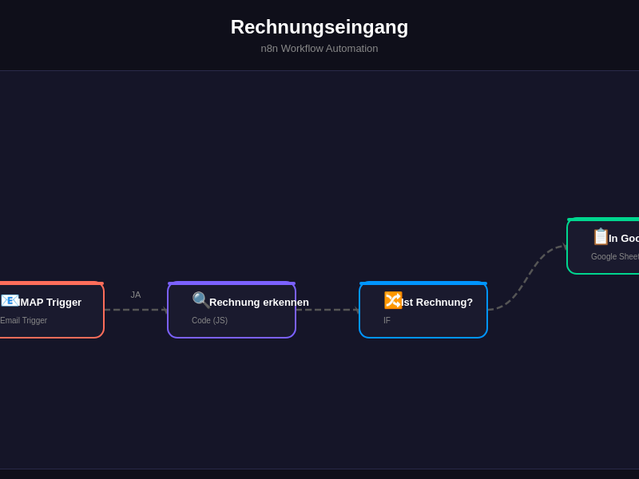
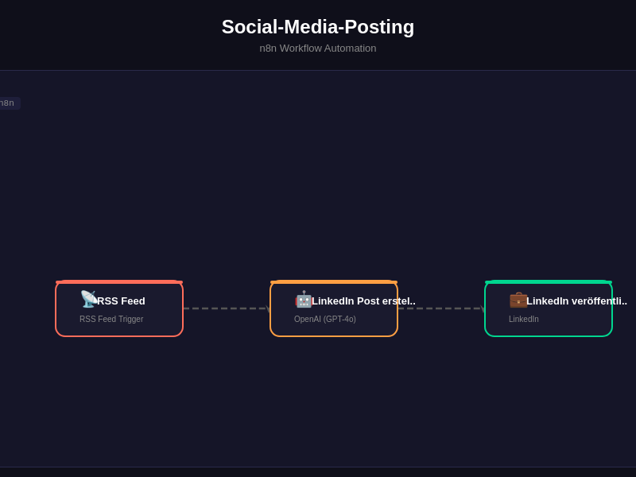
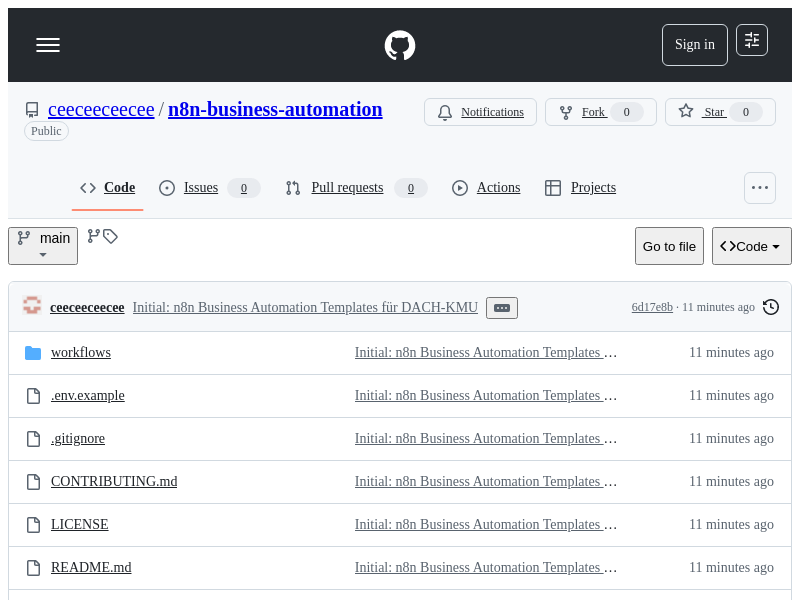
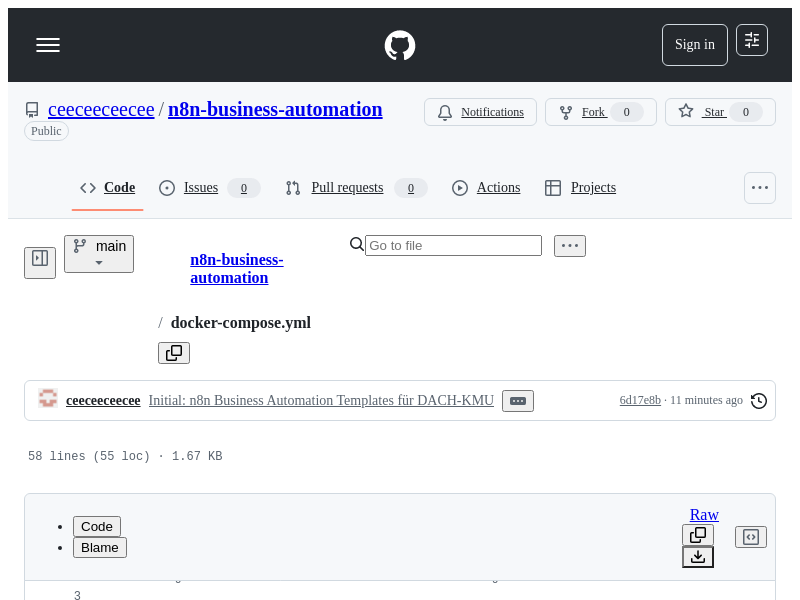

# N8N Business Automation

<p align="center">
</p>

   

> n8n Workflow-Vorlagen für Geschäftsprozess-Automatisierung im Mittelstand

## Overview

Sammlung professioneller n8n-Workflows für DACH-KMU. Deckt E-Mail-Verarbeitung, Lead-Erfassung, Social-Media, Rechnungseingang und weitere Geschäftsprozesse ab.

## Features

- E-Mail-Klassifizierung & Weiterleitung
- Lead-Erfassung aus Web-Formularen
- Social-Media-Monitoring
- Rechnungseingang-Verarbeitung
- Aufgaben-Verwaltung
- Docker Compose für schnellen Start

## Tech Stack

| Tech | Zweck |
|------|-------|
| n8n | Workflow-Engine |
| Docker Compose | Deployment |
| JSON | Workflow-Format |
| REST APIs | Integrationen |

## Quick Start

```bash
docker compose up -d
# Importiere Workflows aus /workflows
```

## Screenshots

**n8n Workflow-Übersicht**



**E-Mail-Klassifizierung Workflow**



**Lead-Erfassung Workflow**



**Rechnungseingang Workflow**



**Social-Media Workflow**



**Workflow-Architektur**



**Docker Compose Setup**



---

## Contributing

Beiträge sind willkommen! Bitte erstelle einen Issue oder Pull Request.

## License

MIT License — siehe [LICENSE](LICENSE).

<p align="center">
</p>